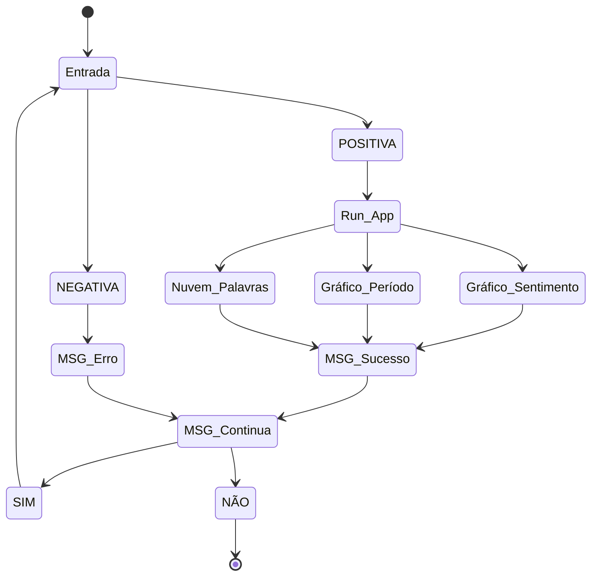

# PyGht Sentiment Time

Diante da dinamicidade introduzida no cotidiano das pessoas pelas mídias sociais, bem como pela evolução tecnológica que proporcionou a coleta, extração e compartilhamento dos dados, muitas informações relevante podem ser obtidas por meio de técnicas de análise de sentimentos.
A partir desse projeto, busca-se encontrar insights a apresentar resultados relevantes sobre a avaliação de sentimentos com base na classificação por polaridade em determinados períodos de tempo, do dia e da semana, produzindo informações e promovendo insights importantes para diversas atividades.

O fluxo da aplicação que será construída pode ser visualizado abaixo:

## Equipe
 - [Amanda Moreira](https://github.com/amandamoreyra)
 - [Rayanne Oliveira dos Santos](https://github.com/RayanneOlivera)
 - [Kaio Emanule](https://github.com/keikorr)
 - [Tarciano Filho](https://github.com/tarcianofilho)
 - [Renato Rodrigues Vieira dos Santos](https://github.com/renato-rodrig)
 - [Leonardo Monteiro](https://github.com/lemont037)
 - [Ítalo Magalhães](https://github.com/italo-mgl)
 - [José Aurelio Kovalczuk de Oliveira](https://github.com/joseaureliok)
