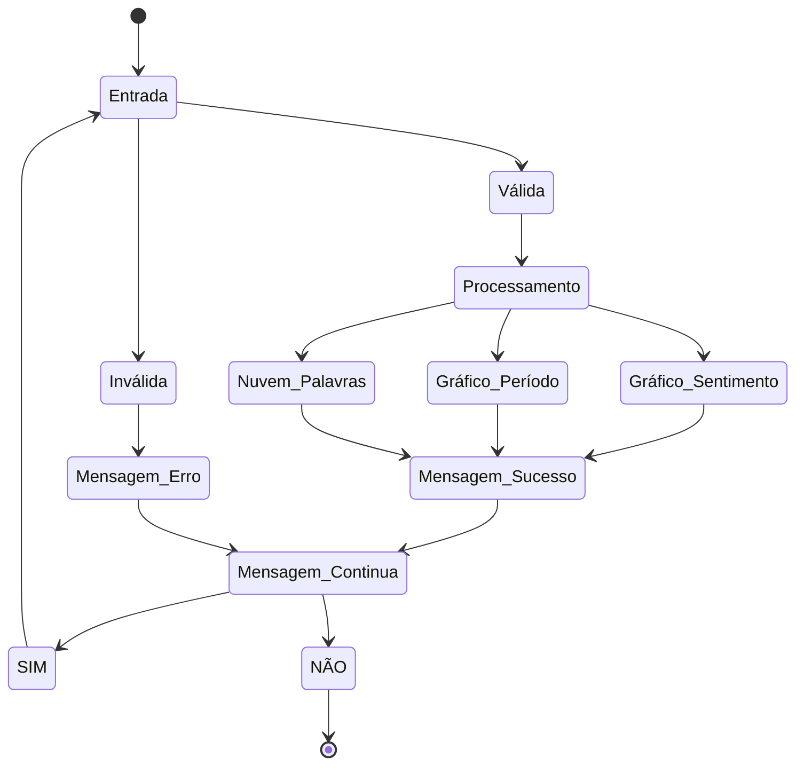

# PyGht Sentiment Time

O Twitter desde de sua criação tem se destacado como uma notória rede social, seja pela sua gama de usuários, ou pela quantidade de conteúdos criados a cada momento! Conteúdos estes que por sua vez geram dados e mais dados, dados que ultrapassam a barreira dos 280 caracteres e chegam para nós em inúmeros formatos, sejam posts, imagens, hashtags... A partir desse projeto, busca-se encontrar insights a apresentar resultados relevantes sobre a avaliação de sentimentos por esses dados trazidos, com base na classificação por polaridade em determinados períodos de tempo, do dia e da semana, produzindo informações e promovendo insights importantes para diversas atividades. Diante da dinamicidade introduzida no cotidiano das pessoas pelas mídias sociais, bem como pela evolução tecnológica que proporcionou a coleta, extração e compartilhamento dos dados, muitas informações relevantes podem ser obtidas por meio de técnicas de análise de sentimentos. De forma mais específica, busca-se que a aplicação exija do usuário a apresentação de tema por meio de palavra-chave ou palavras-chave, que passará por análise algorítmica e retornará gráficos com análise de sentimento, períodos de variação dos sentimentos presentes e nuvem de palavras para o(s) tema(s) sugerido(s). 

## Fluxo da Aplicação

## Desenvolvedores
 - [Tarciano Filho](https://github.com/tarcianofilho)
 - [Renato Rodrigues](https://github.com/renato-rodrig)
 - [Rayanne Oliveira](https://github.com/RayanneOlivera)
 - [José Aurelio](https://github.com/joseaureliok)
 - [Kaio Emanuel](https://github.com/keikorr)
 - [Ítalo Magalhães](https://github.com/italo-mgl)
 - [Amanda Moreira](https://github.com/amandamoreyra)
 - [Leonardo Monteiro](https://github.com/lemont037)

---

